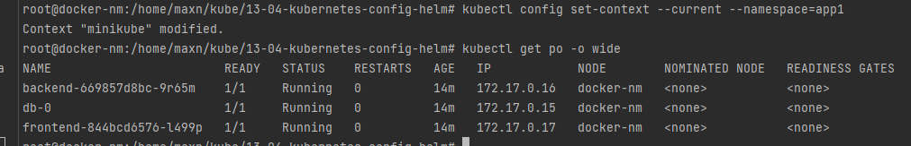
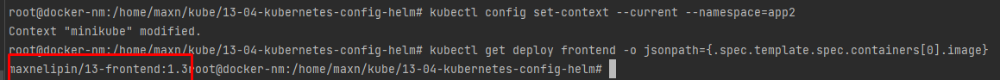

# 13-04-kubernetes-config-helm

В тот же namespace не ставится, что вполне логично, т.к. сервисы имеют такие же имена.
ТОлько если менять имя сервисов типа frontend_1.2, 
но управлять и дебажить проблемы очень неудобно будет

В разных namespace работает 

Версия образа в namespace=app1

Запущенные pod в namespace=app1

Версия образа в namespace=app2

Запущенные pod в namespace=app2

